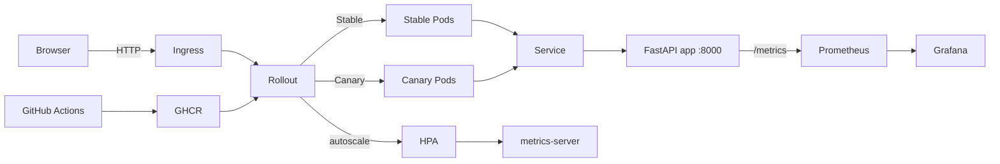
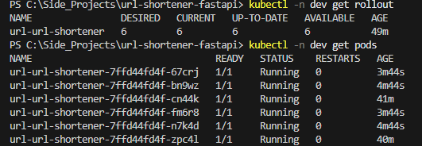
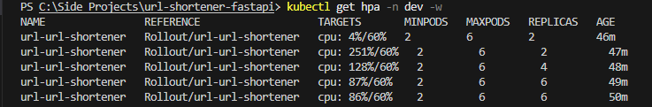

# URL Shortener (FastAPI) — Prod-Style DevOps Demo

A production-style microservice showcasing **modern DevOps practices** end-to-end:

- Python FastAPI microservice, containerized with Docker
- Helm-managed Kubernetes deployment
- GitHub Actions CI: build, tag, push to GHCR + Trivy security scans + Helm lint/template checks
- Autoscaling with HPA (metrics-server)
- Observability with Prometheus + Grafana (ServiceMonitor)
- NGINX Ingress
- Progressive delivery with **Argo Rollouts (canary 20→40→60 with pauses)**

---

## 🖼 Architecture

## 📸 Production Observability Snapshots

### Canary Rollout (Argo Rollouts)

### Autoscaling CPU Load Test (HPA)

### Live Request Metrics (Grafana)

